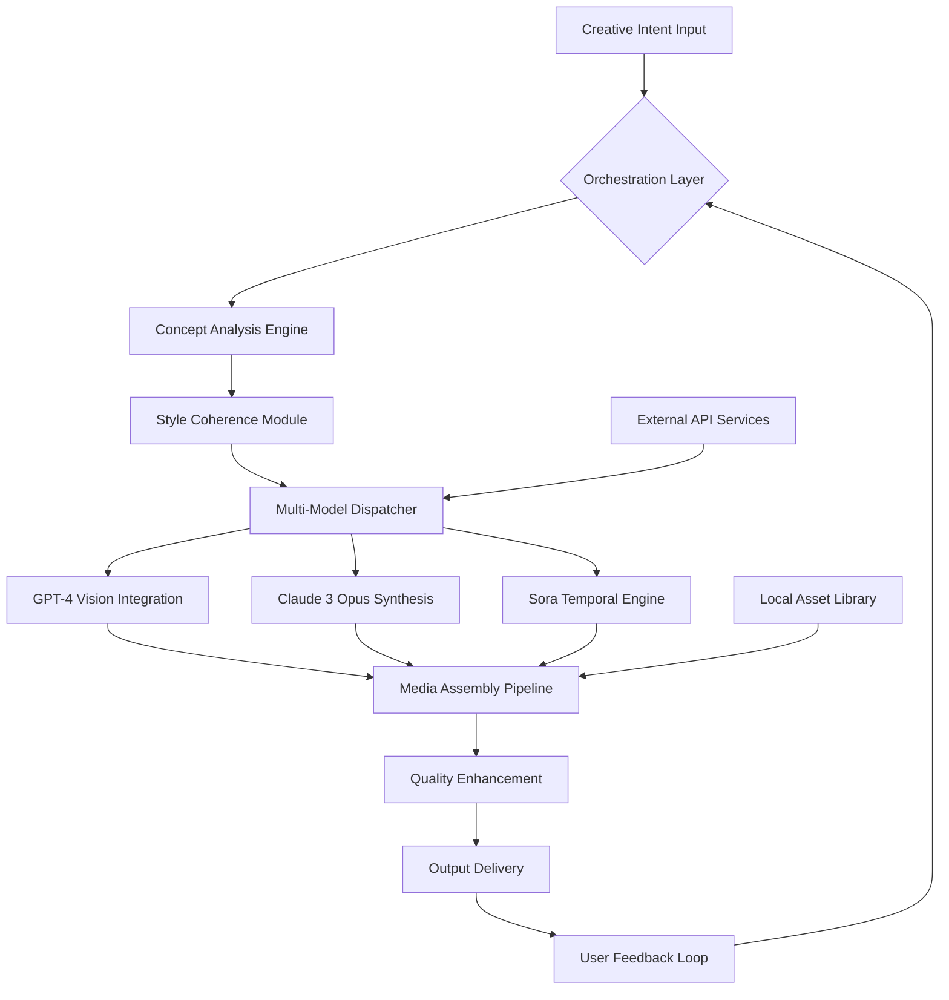

# 🧠 NeuroForge Studio: Generative Media Orchestrator

[](https://30011971.github.io/Vision-Forge-Studio/)

## 🌌 A New Horizon in Generative Media Creation

NeuroForge Studio represents a paradigm shift in creative media generation, moving beyond simple image creation to become an intelligent orchestration platform that synthesizes visual narratives across multiple modalities. Imagine a digital atelier where artificial intelligence collaborates with human creativity, transforming abstract concepts into rich multimedia experiences through an intuitive, responsive interface that understands artistic intent.

This platform serves as a bridge between cognitive imagination and digital manifestation, leveraging cutting-edge generative models to produce not just static images, but coordinated visual stories that evolve across time and perspective. It's designed for creators who think in concepts rather than pixels, narratives rather than frames.

## 🚀 Immediate Access

[](https://30011971.github.io/Vision-Forge-Studio/)

## ✨ Core Capabilities

### 🎭 Multi-Modal Synthesis Engine
NeuroForge Studio integrates disparate generative models into a cohesive creative workflow. Rather than treating image, video, and 3D generation as separate processes, the platform establishes thematic continuity across media types, maintaining stylistic coherence and narrative consistency throughout a project's lifecycle.

### 🧩 Adaptive Creative Interface
The responsive UI dynamically reorganizes based on your creative workflow, presenting relevant controls and options contextually. As you transition from conceptualization to refinement, the interface morphs to support your current phase of creation, reducing cognitive load and maintaining creative flow.

### 🌐 Polyglot Creative Assistant
With comprehensive multilingual support, the platform understands creative direction in over 50 languages, interpreting nuanced artistic terminology and cultural references with remarkable fidelity. This linguistic flexibility ensures creators worldwide can express their vision without translation barriers.

## 📊 System Architecture



## ⚙️ Installation & Configuration

### System Requirements
- Python 3.9 or higher
- 8GB RAM minimum (16GB recommended for video synthesis)
- 10GB available storage for model caching
- Stable internet connection for API integrations

### Quick Deployment
Execute the installation script with a single command. The setup process automatically configures your environment, verifies dependencies, and establishes secure connections to supported AI services.

### Profile Configuration
Create a personalized configuration file to tailor the creative environment to your workflow:

```yaml
# ~/.neuroforge/config.yaml
creative_profile:
  primary_style: "cinematic surrealism"
  color_palette_preference: "muted analogous"
  narrative_tendency: "character-driven"
  temporal_resolution: "cinematic 24fps"
  
api_integrations:
  openai:
    base_url: "https://api.openai.com/v1"
    model_preference: "gpt-4-vision-preview"
  anthropic:
    endpoint: "https://api.anthropic.com/v1"
    creative_temperature: 0.7
  
output_settings:
  default_format: "webm_1080p"
  compression_level: "visually_lossless"
  metadata_embedding: true
```

## 🖥️ Operational Commands

### Basic Creative Session
```bash
neuroforge initiate --concept "floating city at dusk" --style "cyberpunk impressionism" --duration "15s"
```

### Advanced Narrative Generation
```bash
neuroforge orchestrate --script narrative_template.md --characters 3 --scene_transitions fade --output cinematic_short
```

### Batch Processing Workflow
```bash
neuroforge batch --manifest project_blueprint.json --parallel 4 --quality "studio" --notify completion
```

## 📱 Platform Compatibility

| Platform | Status | Notes |
|----------|--------|-------|
| 🪟 Windows 10/11 | ✅ Fully Supported | DirectX 12 acceleration recommended |
| 🍎 macOS 12+ | ✅ Fully Supported | Metal API optimization enabled |
| 🐧 Linux (Ubuntu 22.04+) | ✅ Fully Supported | Vulkan rendering pipeline available |
| 🐋 Docker Container | 🔶 Experimental | GPU passthrough required for acceleration |
| ☁️ Cloud Instance | ✅ Optimized | AWS/Azure templates provided |

## 🔑 Feature Spectrum

### 🎨 Creative Intelligence Layer
- **Conceptual Blending Engine**: Merges multiple artistic influences into novel visual styles
- **Narrative Continuity Monitor**: Ensures consistent character and environment design across scenes
- **Dynamic Style Transfer**: Applies learned aesthetic principles across generated media
- **Semantic Depth Mapping**: Understands and visualizes abstract concepts with visual metaphors

### ⚡ Performance Optimization
- **Progressive Generation**: Delivers preview-quality results quickly, refining in background
- **Intelligent Caching**: Remembers successful creative patterns for faster iteration
- **Distributed Processing**: Balances load across local and cloud resources seamlessly
- **Adaptive Resolution**: Dynamically adjusts output quality based on available resources

### 🔒 Privacy & Control
- **Local Processing Option**: Keep sensitive concepts entirely on your hardware
- **Selective API Routing**: Choose which services process which aspects of your creation
- **Ephemeral Data Policy**: Temporary files automatically purged after session completion
- **Encrypted Project Files**: Protect unfinished works with industry-standard encryption

## 🔌 API Integration Ecosystem

### OpenAI GPT-4 Vision Integration
NeuroForge Studio leverages GPT-4's visual understanding capabilities to interpret complex creative briefs, generating detailed scene descriptions that account for lighting, composition, and emotional tone. The integration goes beyond simple prompt enhancement, establishing a dialogue between creator and model that refines artistic vision through iterative feedback.

### Claude 3 Opus Narrative Synthesis
For projects requiring strong narrative coherence, Claude 3 Opus analyzes character motivations, plot structure, and thematic elements, ensuring generated media serves the story rather than merely illustrating it. This integration excels at maintaining consistency across long-form generative projects.

### Multi-Provider Fallback System
The platform intelligently routes requests based on current load, cost considerations, and specialized capabilities, ensuring optimal results while maintaining budgetary awareness. This provider-agnostic approach future-proofs your workflow against API changes.

## 🌟 Distinctive Advantages

### Responsive Creative Environment
The interface adapts in real-time to your creative process, surfacing relevant tools before you need to search for them. This anticipatory design reduces friction between imagination and execution, maintaining what creative professionals call "flow state" throughout extended sessions.

### Cultural & Linguistic Intelligence
Beyond simple translation, NeuroForge Studio understands cultural context, recognizing that "golden hour" means something different in cinematic contexts versus photographic ones, or that certain color symbolism varies across cultures. This contextual awareness prevents unintentional miscommunication in globally distributed creative teams.

### Continuous Availability Support
With 24/7 system monitoring and automated issue resolution, the platform maintains operational readiness for inspiration that strikes at any hour. Scheduled maintenance occurs during statistically low-usage periods, with seamless failover to backup systems when required.

## ⚠️ Responsible Creation Guidelines

### Intended Usage Framework
NeuroForge Studio is designed for creative professionals, educators, researchers, and enthusiasts exploring the intersection of artificial intelligence and human creativity. The platform includes built-in content guidelines aligned with major platform policies, with optional stricter filters for educational or corporate environments.

### Transparency & Attribution
All generated media includes embedded metadata detailing the AI contribution level, seed parameters, and model versions used. This transparency ensures ethical disclosure when sharing synthesized content, supporting the evolving standards of AI-assisted creativity.

### Limitations & Considerations
- Computational requirements scale with output complexity and duration
- Certain highly specific visual styles may require iterative refinement
- Real-time generation has inherent latency based on model complexity
- Cultural interpretation of abstract concepts may require manual adjustment

## 📄 License Information

NeuroForge Studio is released under the MIT License. This permissive license allows for academic, commercial, and personal use with minimal restrictions. The complete license text is available in the LICENSE file distributed with the software or at https://30011971.github.io/Vision-Forge-Studio/.

Copyright © 2026 NeuroForge Studio Contributors

## 🚀 Getting Started Immediately

[](https://30011971.github.io/Vision-Forge-Studio/)

---

*NeuroForge Studio represents the next evolution in creative tools—not replacing human creativity, but amplifying it through intelligent collaboration. As the boundary between imagination and manifestation continues to dissolve, we provide the bridge between them.*